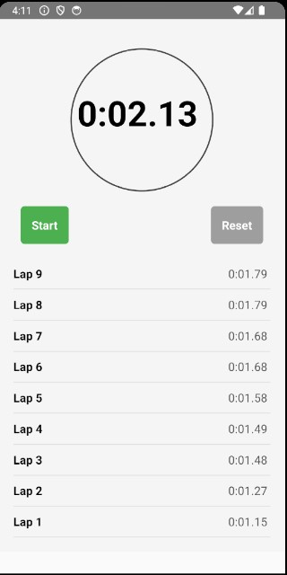

# LapTimer App

A React Native project for managing lap timing functionality with features to **start**, **stop**, **record laps**, and **reset** the timer.

## Features

- Start and stop the timer.
- Record multiple lap times.
- Reset the timer and clear lap records.
- Simple and intuitive user interface.

## Installation

1. **Clone the repository**:

   ```bash
   git clone https://github.com/sabarikennady/LapTimer
   cd laptimer-app
   ```

2. **Install dependencies**:

   ```bash
   npm install
   # or
   yarn install
   ```

3. **Run the app**:

   - For iOS:
     ```bash
     npx react-native run-ios
     ```
   - For Android:
     ```bash
     npx react-native run-android
     ```

## How to Use

1. **Start/Stop Timer**: Tap the "Start" button to begin the timer. Tap "Stop" to pause it.
2. **Record Laps**: Tap the "Lap" button to record the current timer value.
3. **Reset Timer**: Tap the "Reset" button to reset the timer and clear all lap records.

## Technologies Used

- **React Native**
- **JavaScript**

## App Screenshot



## Contribution

Feel free to fork the repository and submit pull requests for any enhancements or bug fixes.

## License

This project is licensed under the [MIT License](LICENSE).

---

Developed with ❤️ using React Native.

